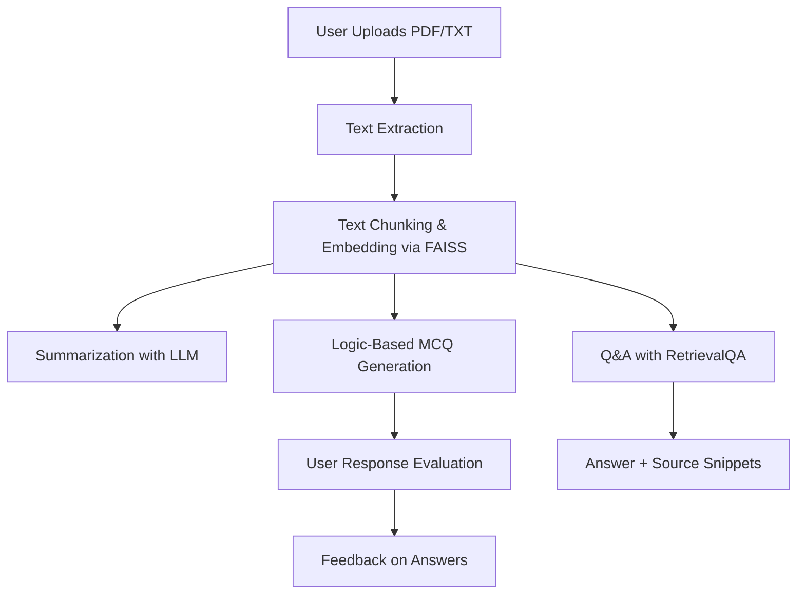

# 📚 EZ GenAI – Smart Assistant for Research Summarization

An AI-powered research assistant built with **Streamlit**, **LangChain**, and **Groq API**, designed to intelligently **summarize**, **query**, and **challenge users** with MCQs based on uploaded PDF/TXT research documents.

🔗 **Live App**: [https://ezgenaiproject-rajeevkumar.streamlit.app/](https://ezgenaiproject-rajeevkumar.streamlit.app/)
📜 **License**: [](https://github.com/0221csds146/EZ_Gen_Ai_project/blob/main/LICENSE)

---

## 🚀 Features

- ✅ Upload and process `.pdf` or `.txt` documents
- ✨ AI-generated **summary**
- 🔍 Ask **custom questions** with source references
- 🧠 "Challenge Me" mode with **logic-based MCQs** and answer feedback
- 💬 **Conversational Q&A** using memory buffer
- ⚡ Fast response powered by **Groq’s LLaMA3 LLMs**

---

## 🧱 Architecture & Reasoning Flow


---
## ⚙️ Setup Instructions

### 1. Clone the repository

```bash
git clone https://github.com/0221csds146/EZ_Gen_Ai_project.git
cd EZ_Gen_Ai_project
```

### 2. Create and activate a virtual environment (optional but recommended)

```bash
# Linux/macOS
python -m venv venv
source venv/bin/activate

# Windows
python -m venv venv
venv\Scripts\activate
```

### 3. Install the dependencies

```bash
pip install -r requirements.txt
```

### 4. Configure your API key

You need a **Groq API Key** for LLaMA3 access.

#### Option A – Create a `.env` file:

```ini
GROQ_API_KEY=your_groq_key_here
```

#### Option B – Use Streamlit Secrets:

Create a file at `.streamlit/secrets.toml`:

```toml
GROQ_API_KEY = "your_groq_key_here"
```
---
### 5. Run the Streamlit app

```bash
streamlit run main.py
```

## 📂 Project Structure
```bash
EZ_Gen_Ai_project/
├── main.py                 # Streamlit frontend
├── backend.py              # LangChain logic + prompt handling
├── prompts.py              # Prompt templates
├── requirements.txt
├── .env / secrets.toml     # API keys
└── README.md
```
---
## 🧰 Tech Stack

| Technology         | Description                                                 |
|--------------------|-------------------------------------------------------------|
| **Python**         | Core backend language used to build the application         |
| **Streamlit**      | UI framework for creating the interactive web app           |
| **LangChain**      | Framework for managing LLM chains (Q&A, summarization, MCQs)|
| **Groq API (LLaMA3)** | Fast LLM used for all generative tasks                    |
| **FAISS**          | Vector database for efficient semantic search               |
| **PyPDF2**         | PDF text extraction utility                                 |
| **dotenv / Secrets** | Secure handling of API keys using `.env` or Streamlit secrets |

---
## 💡 Acknowledgements

- [Groq LLaMA3 API](https://console.groq.com/) – For blazing fast LLM inference
- [LangChain](https://www.langchain.com/) – For orchestration of LLM applications
- [Streamlit](https://streamlit.io/) – For building interactive web interfaces
- [FAISS](https://github.com/facebookresearch/faiss) – For efficient vector searchs
- [OpenAI ChatGPT](https://chat.openai.com/) – For brainstorming, debugging, and generating ideas
- [Anthropic Claude](https://www.anthropic.com/index/claude) – For logic testing and prompt design

---
## 🤝 License

This project is licensed under the [MIT License](https://github.com/0221csds146/EZ_Gen_Ai_project/blob/main/LICENSE).
